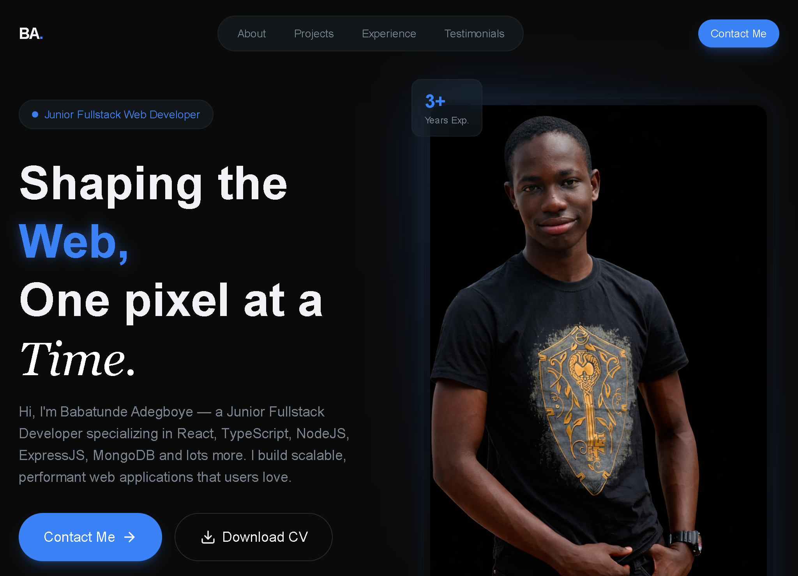

Absolutely! Here's a **comprehensive, professional README template** for your **React + Tailwind CSS portfolio**. It’s recruiter-friendly, SEO-conscious, and covers everything a developer, recruiter, or potential client might want to know. You can copy, tweak, and paste it into your GitHub repo.

---

# 📁 README.md – Portfolio Website

```markdown
# Babatunde Adegboye | Frontend Developer Portfolio

Welcome to my **personal portfolio website**! This project showcases my skills, projects, and contact information as a **frontend developer specializing in React and Tailwind CSS**.

---

## 🚀 Live Demo

Check out the live version here: [https://your-portfolio-link.com](https://your-portfolio-link.com)

---

## 💻 Technology Stack

This portfolio was built using modern frontend tools:

| Technology | Purpose |
|-----------|---------|
| **React.js** | Core frontend library for building interactive UI |
| **Tailwind CSS** | Utility-first CSS framework for responsive and clean design |
| **React Router** | Client-side routing for multiple pages |
| **EmailJS** | Contact form integration for sending messages directly to email |
| **Vite / CRA** | React project setup and build tooling |
| **React Helmet Async** | Dynamic metadata for SEO optimization |

---

## 🌐 Features

- **Responsive Design** – Works on mobile, tablet, and desktop
- **Multiple Pages** – Home, Projects, About, Contact
- **SEO Optimized** – Metadata, clean HTML structure, heading hierarchy
- **Contact Form** – Send messages directly to my email using EmailJS
- **Project Showcases** – Interactive project cards with descriptions, links, and images
- **Performance Optimized** – Lazy loading, optimized images, and fast page load
- **Clean Code** – Modular React components for maintainability

---

## 🔧 Installation

Clone this repo and install dependencies:

```bash
# Clone the repo
git clone https://github.com/Babs-unique/Portfolio.git
cd Portfolio

# Install dependencies
npm install
````

---

### ⚡ Running Locally

Start the development server:

```bash
npm start
```

Open [http://localhost:3000](http://localhost:3000) to view your portfolio in the browser.

---

### 🛠 Build for Production

```bash
npm run build
```

The production-ready files will be generated in the `build/` folder.

---

## 📧 Contact Form Setup (EmailJS)

1. Sign up at [EmailJS](https://www.emailjs.com/)
2. Create a service, template, and get your public key
3. Add your keys to `.env` file:

```
REACT_APP_EMAILJS_SERVICE_ID=your_service_id
REACT_APP_EMAILJS_TEMPLATE_ID=your_template_id
REACT_APP_EMAILJS_PUBLIC_KEY=your_public_key
```

4. Your contact form will now send messages directly to your email.

---
## 🌟 SEO & Accessibility Features

* Proper `<h1>` and heading hierarchy
* Meta titles and descriptions for each page using React Helmet Async
* Open Graph tags for social sharing
* Alt text for all images
* Semantic HTML structure (`header`, `main`, `section`, `footer`)

---

## 📌 Contributing

Contributions are welcome! You can:

1. Fork the repo
2. Create a new branch: `git checkout -b feature/your-feature`
3. Make your changes and commit: `git commit -m "Add your message"`
4. Push to branch: `git push origin feature/your-feature`
5. Open a Pull Request

---

## 📜 License

This project is **open source** under the MIT License. See [LICENSE](./LICENSE) for more details.

---

## 🙋 About Me

Hi! I’m **Babatunde Adegboye**, a frontend developer passionate about building **clean, responsive, and interactive web applications**.
Check out my **projects**, reach out via the **contact form**, or connect with me on [LinkedIn](https://www.linkedin.com/in/babatunde-adegboye).

---

## ⭐ Stay Connected

* [LinkedIn](https://www.linkedin.com/in/babatunde-adegboye)
* [GitHub](https://github.com/Babs-unique)
* [Twitter](https://twitter.com/DevTunde5v)

---

> **Tip:** Keep this README updated with new projects and screenshots to make your portfolio look fresh and professional.

```